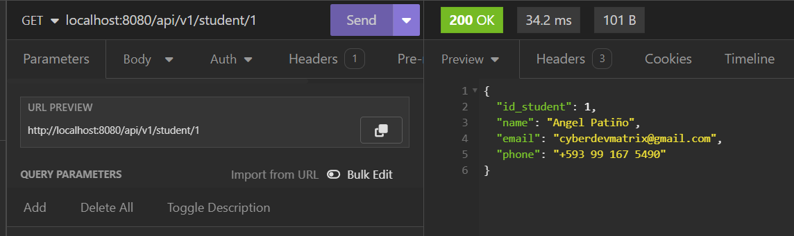
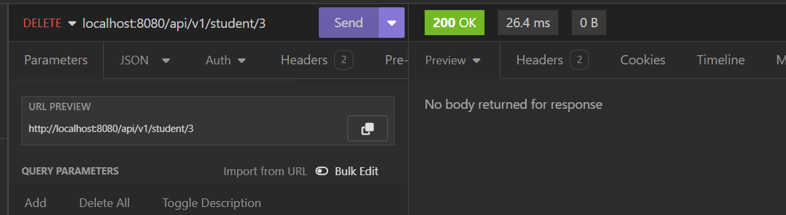
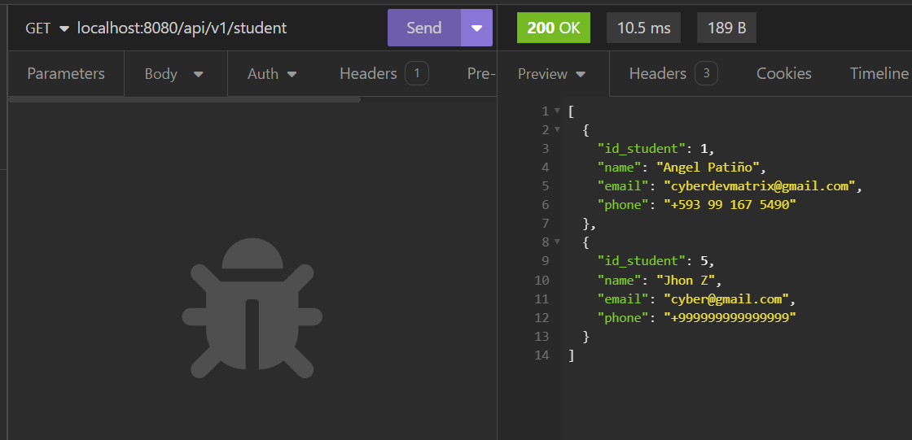

# CRUD Basic Spring about Student

Este es un proyecto básico de CRUD (Create, Read, Update, Delete) desarrollado con Spring Boot y Spring Data JPA para operaciones de persistencia en una base de datos MySQL. Permite la gestión de estudiantes a través de una API REST.

## Result
### Save Student

### List Studend

### Get Student by ID

### Update Student

### Delete Student

### List All finally

### Structure Database and data in MySQL


## Requisitos previos

- Java JDK 17 o superior
- Maven
- MySQL Server

## Configuración de la base de datos

El proyecto utiliza una base de datos MySQL. Asegúrate de tener un servidor MySQL en ejecución y actualiza las siguientes propiedades en el archivo `application.properties` dentro de `src/main/resources` con la configuración de tu base de datos:

```properties
spring.datasource.url=jdbc:mysql://localhost:3306/crud
spring.datasource.username=root
spring.datasource.driver-class-name=com.mysql.cj.jdbc.Driver
spring.jpa.show-sql=true
spring.jpa.hibernate.ddl-auto=create-drop
```

## Ejecución del proyecto

Para ejecutar el proyecto localmente, sigue estos pasos:

1. Clona este repositorio o descarga el código fuente.
2. Navega hasta el directorio raíz del proyecto.
3. Ejecuta el siguiente comando Maven:

```
mvn spring-boot:run
```

Esto iniciará la aplicación Spring Boot. Una vez que la aplicación esté en funcionamiento, podrás acceder a la API REST a través de `http://localhost:8080/api/v1/student`.

## Endpoints disponibles

- `GET /api/v1/student`: Obtiene la lista de todos los estudiantes.
- `GET /api/v1/student/{id}`: Obtiene los detalles de un estudiante por su ID.
- `POST /api/v1/student/save`: Guarda un nuevo estudiante.
- `POST /api/v1/student/update`: Actualiza los detalles de un estudiante existente.
- `DELETE /api/v1/student/{id}`: Elimina un estudiante por su ID.

## Dependencias utilizadas

- Spring Boot Starter Data JPA
- Spring Boot Starter Web
- MySQL Connector/J
- Lombok
- Spring Boot Starter Test
