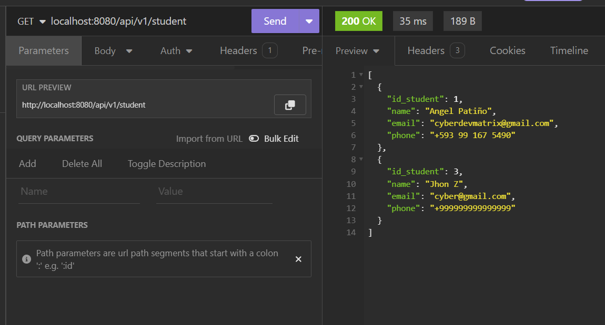

# CRUD Basic Spring Boot about Student

This is a basic CRUD (Create, Read, Update, Delete) project developed with Spring Boot and Spring Data JPA for persistence operations in a MySQL database. It allows the management of students through a REST API.

## **Select Language:**
- [Español (Spanish)](README-es.md)
- [English](README.md)

## Result
### Save Student

### List Studend

### Get Student by ID

### Update Student

### Delete Student

### List All finally

### Structure Database and data in MySQL


## Prerequisites

- Java JDK 17 or higher
- Maven
- MySQL Server

## Database Configuration

The project uses a MySQL database. Make sure you have a MySQL server running and update the following properties in the `application.properties` file inside `src/main/resources` with your database configuration:

```properties
spring.datasource.url=jdbc:mysql://localhost:3306/crud
spring.datasource.username=root
spring.datasource.driver-class-name=com.mysql.cj.jdbc.Driver
spring.jpa.show-sql=true
spring.jpa.hibernate.ddl-auto=create-drop
```

## Running the Project

To run the project locally, follow these steps:

1. Clone this repository or download the source code.
2. Navigate to the project's root directory.
3. Run the following Maven command:

```
mvn spring-boot:run
```

This will start the Spring Boot application. Once the application is up and running, you can access the REST API via `http://localhost:8080/api/v1/student`.

## Available Endpoints

- `GET /api/v1/student`: Get the list of all students.
- `GET /api/v1/student/{id}`: Get details of a student by their ID.
- `POST /api/v1/student/save`: Save a new student.
- `POST /api/v1/student/update`: Update details of an existing student.
- `DELETE /api/v1/student/{id}`: Delete a student by their ID.

## Dependencies Used

- Spring Boot Starter Data JPA
- Spring Boot Starter Web
- MySQL Connector/J
- Lombok
- Spring Boot Starter Test
